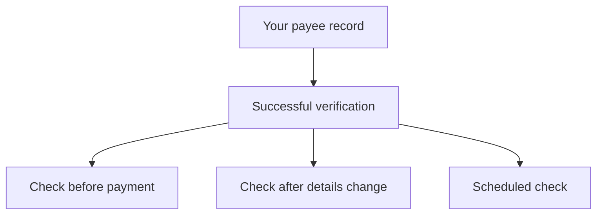

A verification establishes a trusted fingerprint. A check asks a later question: do the details you hold now still match that fingerprint?

Use checks before payment, after payee details change, or on a scheduled review for higher-risk records.

## When to run a check

<CardGroup cols={3}>
  <Card title="Before payment" icon="credit-card">
    Compare the details about to be paid against the successful verification you stored earlier.
  </Card>

  <Card title="After a detail change" icon="pen">
    If your CRM, ERP, or payee portal updates bank details, check the new values before accepting them for payment.
  </Card>

  <Card title="Periodic review" icon="calendar">
    Recheck long-lived or high-value payees on a cadence that matches your risk policy.
  </Card>
</CardGroup>

## How checks relate to verifications

Checks are always attached to a verification. They do not replace onboarding verification, and they do not create a new identity flow for the contact.

If the details have legitimately changed, create another verification and use the same `attribution_id` to keep the history connected.

## Result handling

Treat the check result as a payment-control signal:

| Result | Meaning | Suggested handling |
| --- | --- | --- |
| Uncompromised | Current details align with the verification fingerprint. | Continue with your normal payment approval flow. |
| Compromised | Current details do not align with the fingerprint. | Hold payment and investigate the record before proceeding. |

For exact result fields and endpoint behavior, see [Check a verification](/api-reference/checks/check-a-verification).

## What to store

Store enough state to explain why a payment was allowed or held:

- the verification ID checked against
- your own payee or vendor ID
- the check ID
- the check result
- the timestamp
- the details version from your own system, if you have one

This keeps your audit trail tied to both systems: ezyshield's verification record and your internal payment decision.
