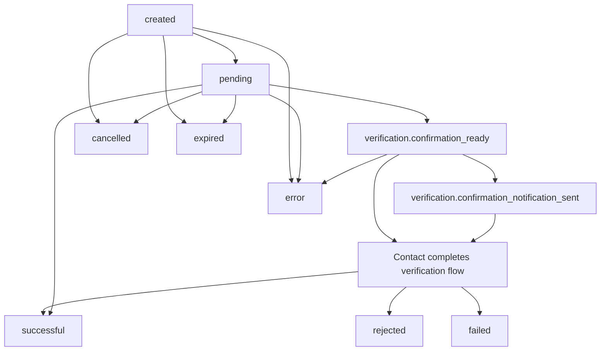

Start with a verification. It is the first call that creates a useful ezyshield record.

<Steps>
  <Step title="Create your organization and API key">
    Sign up in the Dashboard at [app.ezyshield.com.au](https://app.ezyshield.com.au), then create an API key for your organization.

    Choose the key's abilities when you create it. For the first verification, use `verification:read` and `verification:write`. If your app will create or manage webhook subscriptions through the API, create a key that also has `webhook_subscription:read` and `webhook_subscription:write`.
  </Step>

  <Step title="Confirm the key with your organization">
    Call [Get the current organization](/api-reference/organizations/get-the-current-organization). A `200` response confirms the key is valid and shows the organization context attached to the token.

    This is a simple first test because it does not create data or start a contact flow.
  </Step>

  <Step title="Choose a confirmation mode">
    Most integrations should start with `kyc`. The contact receives a verification link, provides identity details, and completes a face scan.

    If you already capture identity documents in your own flow, compare the options in [Choose a confirmation mode](/guides/confirmation-modes) before creating the verification.
  </Step>

  <Step title="Create the verification">
    Call [Create a verification](/api-reference/verifications/create-a-verification) with the payee's business, contact, and bank account details.

    If the payee already exists in your system, send your own stable payee, vendor, customer, or contact ID as `attribution_id`. That links future verifications for the same record.
  </Step>

  <Step title="Store the verification ID">
    Store the ezyshield verification ID against your own record, along with the latest verification status and the timestamp of the latest webhook event you processed.
  </Step>

  <Step title="Receive completion events">
    Use [webhooks](/guides/webhooks) to update your local state when the verification reaches a terminal status. Polling is fine while debugging, but webhooks should be the normal production path.
  </Step>
</Steps>

## Verification lifecycle

Verifications move through a short lifecycle. The exact path depends on the confirmation mode and the result of the identity and bank account checks.

`created` and `pending` are in-progress states. `successful`, `rejected`, `failed`, `cancelled`, `expired`, and `error` are terminal states.

<Note>
`verification.confirmation_ready` and `verification.confirmation_notification_sent` are webhook events, not verification statuses. A verification can complete without those events when there is no contact step, when `individual_confirmation_mode` is `skip`, or when your app delivers the confirmation URL instead of ezyshield sending SMS.
</Note>

## After the first verification

Once the first verification completes, add the supporting pieces in this order:

<CardGroup cols={2}>
  <Card title="Contact verification flow" icon="user-check" href="/guides/contact-verification-flow">
    Prepare the contact for the SMS or verification link.
  </Card>

  <Card title="Receive completion events" icon="webhook" href="/guides/webhooks">
    Configure webhook subscriptions and process events idempotently.
  </Card>

  <Card title="Run checks before payment" icon="magnifying-glass" href="/guides/checks-before-payment">
    Compare current details against the successful verification before money moves.
  </Card>

  <Card title="Linked verifications" icon="link" href="/guides/linked-verifications">
    Use `attribution_id` to keep repeat verifications connected to the same record.
  </Card>
</CardGroup>
