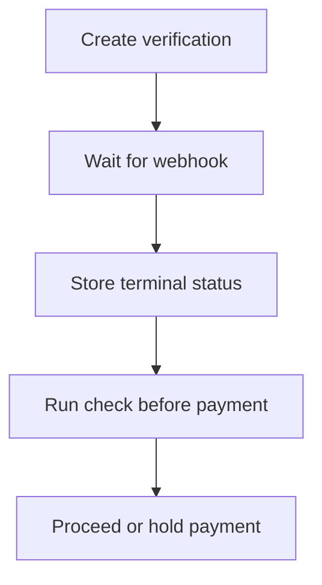

Before going live, make sure your integration can handle the full verification lifecycle, including the paths where the contact rejects, the flow expires, or a webhook is retried.

## Production checklist

<AccordionGroup>
  <Accordion title="API keys">
    Create production API keys with only the abilities your integration needs. Keep keys environment-specific and rotate them through your normal secret-management process.
  </Accordion>

  <Accordion title="Webhook subscriptions">
    Use HTTPS endpoints, verify signatures, store processed event IDs, and return `2xx` quickly. Subscribe to terminal verification events at minimum.
  </Accordion>

  <Accordion title="Local state">
    Store the ezyshield verification ID, the latest status, and the timestamp of the latest processed event against your own record.
  </Accordion>

  <Accordion title="Operational handling">
    Decide what your team does when a verification is `failed`, `rejected`, `expired`, `cancelled`, or `error`. Do this before production traffic starts.
  </Accordion>

  <Accordion title="Payment controls">
    Run checks before payment or before accepting changed bank details. Hold payment when a check indicates the details do not align with the verified fingerprint.
  </Accordion>
</AccordionGroup>

## Production flow

## Support

If a production issue blocks verification or webhook delivery, contact [support@ezyshield.com.au](mailto:support@ezyshield.com.au). Include the verification ID, webhook event ID, organization name, and the approximate time of the issue.
