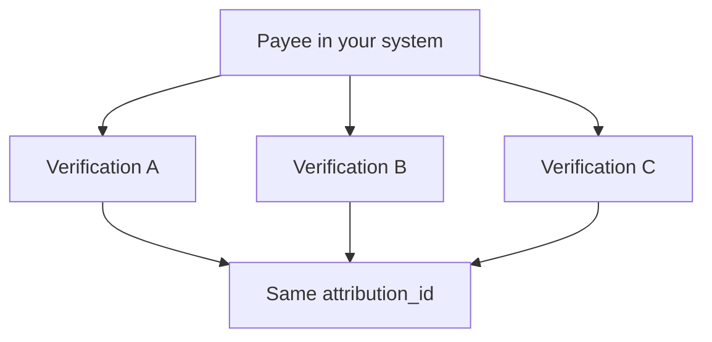

`attribution_id` is your stable reference for the payee, vendor, customer, or contact being verified.

Send it when you create a verification for a record that exists in your system. EasyShield stores it on the verification so you can retrieve related verification history later.

## What to use as attribution_id

Use an ID that is stable in your system:

- a payee ID
- a vendor ID
- a customer ID
- a contact ID
- another durable external reference

Do not use a one-time request ID. You want the same value every time you create a new verification for the same real-world record.

## Why linked verifications matter

Verifications are point-in-time records. If a payee's bank account changes, create another verification for the same payee.

This gives you a history of what was verified, when it was verified, and which verification was current when a payment decision was made.

## Recommended storage pattern

Store the ezyshield state you need on your own record:

| Field in your system | Purpose |
| --- | --- |
| `ezyshield_verification_id` | The current successful verification you trust for payment decisions. |
| `ezyshield_verification_status` | The latest known status from webhook events or API retrieval. |
| `ezyshield_last_event_at` | The latest processed webhook event timestamp. |

## Retrieving history

Use [List all verifications](/api-reference/verifications/list-all-verifications) with `filter[attribution_id]` to retrieve verifications linked to a record.

When a new verification succeeds, make it the current verification for the record in your system. Keep older verifications for audit history.

## Confirmation mode interaction

`attribution_id` is especially useful with contact identity flows. It lets successive verifications for the same record remain connected, and it gives EasyShield context for repeat KYC or biometric flows where previous successful identity evidence may reduce friction.
