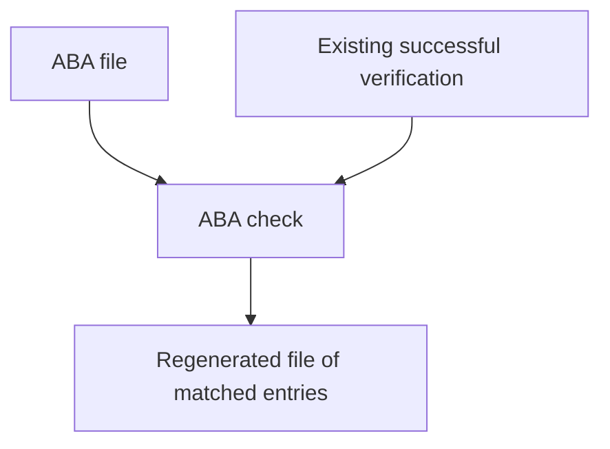

An ABA check is a review of an Australian Banking Association direct entry file. ezyshield parses the file, attempts to match credit entries to existing verifications, and lets you download a regenerated file containing matched entries.

ezyshield does not process the payment. You still process the file in your banking software or payment workflow.

## How it relates to verifications

ABA checks depend on existing verifications. The file check is useful when you already have verified payees and want to review a payment file before processing it elsewhere.

Entries are matched against the latest successful contact-backed verification for the same BSB and account number.

## When to use it

Use ABA checks when:

- your payment process uses ABA direct entry files
- you want to compare file entries against existing successful verifications
- your operations team needs to inspect or download a regenerated file before processing

Use the normal [verification](/objects/verification) and [check](/objects/check) APIs for individual onboarding and payment decisions outside ABA files.

## API surface

Key API operations:

- [Upload a single ABA file](/api-reference/aba-checks/upload-a-single-aba-file)
- [List all ABA checks](/api-reference/aba-checks/list-all-aba-checks)
- [Get an ABA check](/api-reference/aba-checks/get-an-aba-check)
- [Download a regenerated ABA file](/api-reference/aba-checks/download-a-regenerated-aba-file)

For implementation guidance, see [ABA file checks](/guides/aba-file-checks).
