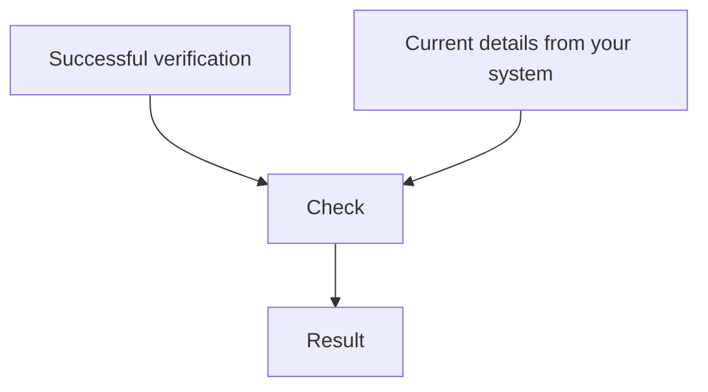

A check runs against an existing [verification](/objects/verification). You supply the details you hold now, and ezyshield compares them to the verification fingerprint.

Checks answer one narrow question: do today's details still align with the details that were successfully verified?

## Relationship to verifications

Checks do not replace a full verification when onboarding a payee. They are a later safety layer for payment decisions and detail changes.

## When to use checks

Use checks:

- before payment
- after bank details change in your system
- during scheduled reviews for high-value or long-lived payees
- when processing file-based payment workflows that depend on verified records

## What to store

Each check is its own record. Store the check ID, result, timestamp, verification ID, and the internal record you checked. This gives your team an audit trail for the payment decision.

## API surface

All check endpoints are nested under a verification:

- [List all checks for a verification](/api-reference/checks/list-all-checks-for-a-verification)
- [Check a verification](/api-reference/checks/check-a-verification) (create a check)
- [Get a check for a verification](/api-reference/checks/get-a-check-for-a-verification)

See [Authentication](/api-reference/authentication) for required abilities (`check:read`, `check:write` per your API key).

For implementation guidance, read [Run checks before payment](/guides/checks-before-payment).
