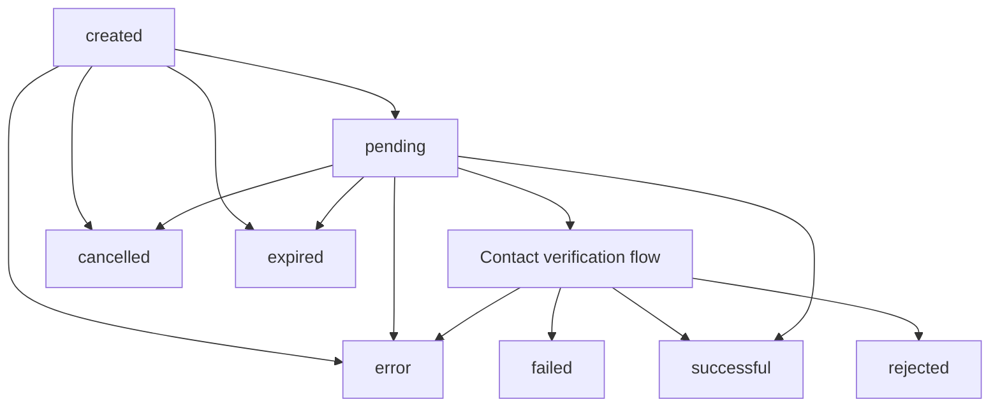

A verification is the central ezyshield object. It records the details you asked ezyshield to verify, the contact identity flow selected for the individual, and the outcome of that verification.

Create a verification when you need to establish whether a payee's details can be trusted. Keep the returned verification ID in your system.

## What a verification contains

Every verification is built from three sets of details:

- business identity, such as name and ABN
- contact identity, such as the individual's legal name and mobile number
- bank account details, such as account name, BSB, and account number

The exact request fields live in [Create a verification](/api-reference/verifications/create-a-verification).

## Lifecycle

A verification starts in an in-progress state and eventually reaches a terminal outcome.

| Status | Meaning |
| --- | --- |
| `created` | The verification record has been created. |
| `pending` | ezyshield is processing the verification or waiting on the contact flow. |
| `successful` | The verification completed successfully. |
| `rejected` | The contact rejected the verification. |
| `failed` | ezyshield could not verify the supplied details. |
| `cancelled` | The verification was cancelled or superseded. |
| `expired` | The contact did not complete the flow in time. |
| `error` | An unexpected error occurred. |

For the human step, see [Contact verification flow](/guides/contact-verification-flow). For webhook events, see [Receive completion events](/guides/webhooks).

## Confirmation modes

The `individual_confirmation_mode` controls how the contact identity step works:

- `kyc` asks the contact to complete the full ezyshield identity flow
- `biometric` asks the contact to complete a face scan against an image you provide
- `skip` omits the contact identity step

Most integrations should start with `kyc`. Compare the modes in [Choose a confirmation mode](/guides/confirmation-modes).

## Attribution and history

Use `attribution_id` to link verifications back to the same record in your system. For example, if your payee has ID `payee_123`, send that same value whenever you create a verification for that payee.

<Tip>
Verifications are point-in-time records. If details change, create another verification and reuse the same `attribution_id`.
</Tip>

Read [Linked verifications with attribution_id](/guides/linked-verifications) for the recommended storage pattern.

## Relationship to checks

A [check](/objects/check) compares current details against a verification fingerprint. Use checks later, before payment or after a detail change. Do not use a check as a substitute for onboarding verification.

For the first integration path, start with [Create your first verification](/guides/first-verification).